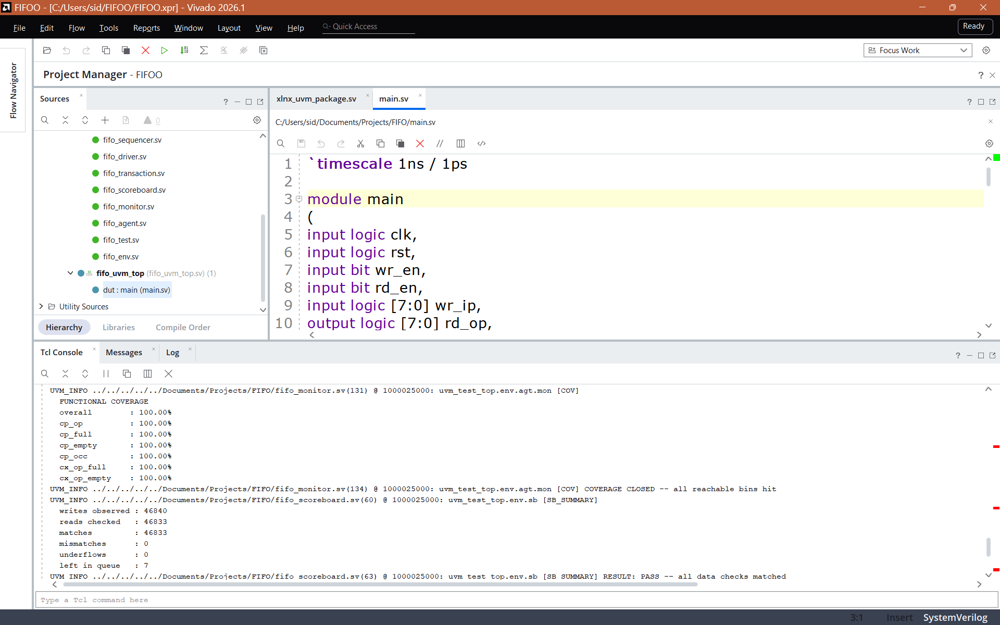
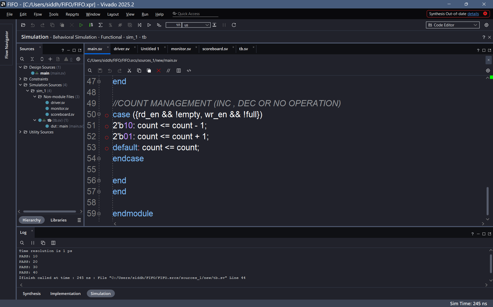

# FIFO — UVM Verification with Functional Coverage Closure



A UVM verification environment for an 8×8 synchronous FIFO, built in SystemVerilog and run in Vivado 2026.1 (xsim). Constrained-random stimulus, queue-based reference model, SVA, and a functional coverage model closed to 100%.

The repository also contains the original class-based (non-UVM) testbench the environment was converted from, kept for comparison. Both testbenches drive the same DUT through the same interface, which is what makes the comparison meaningful rather than two unrelated projects in one repo.

```
RTL/             main.sv, fifo_if.sv          — DUT and interface (shared by both testbenches)
UVM/             11 files                     — the UVM environment
Original FIFO/   4 files + run log            — the pre-UVM class-based testbench
```

---

## Results

| Metric | Result |
|---|---|
| Transactions driven | 100,001 |
| Simulated time | 1,000,025 ns |
| Scoreboard data comparisons | 46,833 |
| Mismatches | **0** |
| Underflows | **0** |
| Functional coverage | **100% — closed** |
| `UVM_ERROR` / `UVM_FATAL` | 0 / 0 |
| Wall-clock runtime | ~16 s |

```
writes observed : 46840
reads checked   : 46833
matches         : 46833
mismatches      : 0
underflows      : 0
left in queue   : 7
RESULT: PASS -- all data checks matched

FUNCTIONAL COVERAGE
overall        : 100.00%
COVERAGE CLOSED -- all reachable bins hit
```

Writes minus reads equals the residue left in the FIFO (46,840 − 46,833 = 7), so every byte written was either read back and verified or still resident. Nothing was silently dropped.

---

## DUT

An 8-bit wide, 8-deep synchronous FIFO.

- Registered read output (1-cycle read latency)
- `full` / `empty` flag generation
- Concurrent read and write support
- Three inline SVA properties, checked in simulation: no write when full, no read when empty, occupancy stays within `[0:8]`

---

## Verification architecture

```
          ┌──────────────────────── fifo_env ────────────────────────┐
          │                                                           │
          │   ┌────────────── fifo_agent ──────────────┐              │
          │   │                                         │             │
 sequence─┼──▶│ sequencer ──▶ driver ──┐       monitor ─┼──analysis──▶│ scoreboard
          │   │                         │          ▲    │    port     │  (reference
          │   └─────────────────────────┼──────────┼────┘             │    model)
          │                             │          │                  │
          └─────────────────────────────┼──────────┼──────────────────┘
                                        ▼          │
                                   ┌── fifo_if (clocking block) ──┐
                                   │                              │
                                   └──────────▶ DUT (main.sv) ────┘
```

| File | Role |
|---|---|
| `RTL/main.sv` | DUT — the FIFO itself, with inline SVA |
| `RTL/fifo_if.sv` | Interface with clocking block |
| `UVM/fifo_transaction.sv` | Sequence item; constrained so illegal stimulus is never generated |
| `UVM/fifo_sequence.sv` | Constrained-random stimulus generator |
| `UVM/fifo_sequencer.sv` | Sequencer |
| `UVM/fifo_driver.sv` | Drives the DUT through the clocking block |
| `UVM/fifo_monitor.sv` | Observes the interface, broadcasts transactions, owns the covergroup |
| `UVM/fifo_scoreboard.sv` | Queue-based reference model and checker |
| `UVM/fifo_agent.sv` | Bundles sequencer + driver + monitor |
| `UVM/fifo_env.sv` | Bundles agent + scoreboard |
| `UVM/fifo_test.sv` | Top-level test; starts the sequence |
| `UVM/fifo_pkg.sv` | Package that includes all classes in dependency order |
| `UVM/fifo_uvm_top.sv` | Simulation top: clock, reset, DUT instantiation, `run_test()` |
| `Original FIFO/driver.sv` `monitor.sv` `scoreboard.sv` `tb.sv` | Original non-UVM testbench, kept for comparison |

---

## Running it

**Vivado setup**

1. Add to Simulation Sources: `RTL/fifo_if.sv`, `RTL/main.sv`, `UVM/fifo_pkg.sv`, `UVM/fifo_uvm_top.sv`, and the nine class files from `UVM/`
2. Set the nine class files to file type **Verilog Header** — they are compiled via `UVM/fifo_pkg.sv`, never standalone
3. Simulation top: `fifo_uvm_top`
4. Settings → Simulation → **Elaboration** → `xelab.more_options`: add `-L uvm`
5. Run Behavioral Simulation, then **Run All** (the default 1000 ns runtime truncates the test)

**Compile order:** `RTL/fifo_if.sv` → `RTL/main.sv` → `UVM/fifo_pkg.sv` → `UVM/fifo_uvm_top.sv`

`fifo_pkg.sv`'s `` `include `` paths resolve relative to the package file, so the nine class files must stay alongside it in `UVM/`.

**Runtime options** (`xsim.simulate.more_options`)

| Option | Effect |
|---|---|
| `+RUNCYCLES=<n>` | Set transaction count without recompiling (default 100,001) |
| `+UVM_VERBOSITY=UVM_HIGH` | Print every individual data check |

---

## Functional coverage

The covergroup lives in the monitor and samples once per clock.

| Coverpoint | What it proves |
|---|---|
| `cp_op` | All four operations issued: IDLE / READ / WRITE / BOTH |
| `cp_full` | Full was reached **and** transitioned into and out of (`0=>1`, `1=>0`) |
| `cp_empty` | Empty was reached and transitioned into and out of |
| `cp_occ` | Every occupancy level 0–8 was visited |
| `cx_op_full` | Which operations occurred while full |
| `cx_op_empty` | Which operations occurred while empty |

The monitor's `report_phase` prints the per-coverpoint breakdown and emits `COVERAGE CLOSED` at 100%, or a `uvm_warning` below it — so closure is machine-checkable rather than eyeballed.

---

# Problems faced

Every issue encountered across both testbenches, grouped by nature, with the symptom, the root cause, and the path taken — including options considered and rejected.

---

## 1. Timing and race conditions

These were the hardest to diagnose, because nothing errors — the simulation runs happily and produces wrong data.

### 1.1 Read data shifted by one cycle (UVM)

**Symptom.** 38 scoreboard mismatches with a distinctive signature — `Got` was always the *previous* `Expected`:

```
@85000  MISMATCH Expected=92  Got=0
@115000 MISMATCH Expected=123 Got=92
@195000 MISMATCH Expected=199 Got=123
```

**Cause.** The driver assigned the raw interface signals on a clock edge:

```systemverilog
@(posedge vif.clk);
vif.wr_en <= tr.wr_en;      // races the DUT's always_ff on the same edge
```

Testbench assignment and DUT sampling landed on the same edge, shifting all data by one cycle.

**Path chosen.** Drive through the clocking block, which applies values at its defined output skew:

```systemverilog
@(vif.cb);
vif.cb.wr_en <= tr.wr_en;
```

Zero mismatches on the next run — the transaction that failed at 85,000 ns passed with the identical expected value.

**Rejected.** Adding a delay (`#1`) after the edge to dodge the race. That hides the problem behind a magic number and breaks the moment the clock period changes. The interface already declared a clocking block for exactly this purpose; the driver simply wasn't using it.


*The original class-based testbench running against the same DUT.*

### 1.2 Latency misalignment between `rd_en` and `rd_op` (non-UVM)

**Symptom.** Read data compared against the wrong queue entry.

**Cause.** The DUT registers its read output, so `rd_op` is valid one cycle after `rd_en` is asserted.

**Path chosen.** Delay the read-enable by one cycle in the monitor (`rd_en_d1`) and compare when the *delayed* enable is high, so the check aligns with when data is actually present. Carried forward unchanged into the UVM monitor.

### 1.3 Driver reading DUT status signals (non-UVM)

**Symptom.** Intermittent, hard-to-reproduce stimulus errors.

**Cause.** The driver made decisions based on the DUT's live `full`/`empty` flags, creating a same-cycle dependency between generation and design state.

**Path chosen.** Give the stimulus its own model. The driver — and later the sequence — tracks `expected_count` independently and never reads DUT outputs. Generation cannot race the design if it never looks at it.

### 1.4 Scoreboard desynchronization on underflow (non-UVM)

**Symptom.** After a single underflow, every subsequent comparison was wrong.

**Cause.** Popping from an empty reference queue left the model permanently offset from the DUT.

**Path chosen.** Detect and report the empty-queue case explicitly instead of popping. A desynchronized scoreboard reports thousands of failures from one root cause; flagging the underflow keeps the first failure readable.

---

## 2. Compilation and scoping

### 2.1 `fifo_transaction is not declared`

**Symptom.** `fifo_sequencer.sv` could not see `fifo_transaction`, despite both being in the project.

**Cause.** Each `.sv` file compiled as its own compilation unit, so class definitions were invisible to one another.

**Path chosen.** Wrap every class in a package (`fifo_pkg.sv`) that `` `include ``s them in dependency order, giving them one shared scope. This is why production UVM environments are package-based.

**Rejected.** Manually ordering the files in Vivado's compile-order view. It appeared to work at first and is how the problem was initially approached — but it is fragile, tool-specific, and does not survive the file list changing.

### 2.2 Class files still compiling standalone

**Symptom.** After adding the package, the same "not declared" errors persisted.

**Cause.** The class files were still listed as compiled sources, so each was *also* compiled on its own, outside the package.

**Path chosen.** Set the nine class files to file type **Verilog Header** in Vivado. They stay in the project and remain editable, but are pulled in only through the package.

### 2.3 The same file compiled twice

**Symptom.** Duplicate-declaration errors for the interface.

**Cause.** `fifo_if.sv` had been added to both Design Sources and Simulation Sources.

**Path chosen.** Keep one copy in Design Sources — it is compiled for simulation anyway — and remove the duplicate.

---

## 3. UVM framework and phasing

### 3.1 `UVM_FATAL: Requested test from call to run_test(fifo_test) not found`

**Symptom.** Elaboration succeeded, then the simulation died immediately at 15 ns.

**Cause.** The top module referenced the test only as a *string*. Nothing pulled the class files into elaboration, so the factory had never registered `fifo_test`.

**Path chosen.** `import fifo_pkg::*;` in the top module — this makes every class visible and registered, and keeps `run_test()` string-driven so the test can still be swapped from the command line.

### 3.2 `UVM_FATAL [RUNPHSTIME]: The run phase must start at time 0`

**Symptom.** Fatal at 15 ns, immediately after reset completed.

**Cause.** The reset sequence ran *before* `run_test()`, consuming 15 ns. UVM requires the run phase to begin at time 0.

**Path chosen.** Move reset into its own `initial` block so it runs *concurrently* with UVM, and have the driver and monitor each wait on `rst` deasserting before acting. This also prevents the monitor from observing reset-time activity and pushing phantom transactions into the scoreboard.

**Rejected.** Turning reset into a UVM sequence. Reset here is a one-time, deterministic, non-randomized event — routing it through the sequencer/driver path would be machinery without benefit.

### 3.3 Embedded covergroup constructed in the wrong phase

**Symptom.** `ERROR: [VRFC 10-8922] embedded coverage group 'cg' cannot be instantiated outside the 'new' method of the encompassing class`.

**Cause.** The covergroup was moved to `build_phase` out of a concern that the virtual interface was still null in `new()`.

**Path chosen.** Construct it in `new()`, as the language requires. The concern was unfounded: coverpoint expressions are evaluated when `sample()` is called, not at construction, and by then `vif` has long been resolved in `build_phase`.

---

## 4. Coverage modelling

### 4.1 A covergroup that measured nothing

**Symptom.** The original covergroup — four 1-bit coverpoints (`wr_en`, `rd_en`, `full`, `empty`) plus one cross — reported 100% within a few hundred cycles.

**Cause.** Every bin is trivially hit by random traffic. The metric was technically closed and substantively meaningless.

**Path chosen.** Replace it with a model of FIFO *behaviour*: operation type (`IDLE`/`READ`/`WRITE`/`BOTH`), **transition** bins on `full` and `empty` (`0=>1`, `1=>0`) to prove the flags were entered and left, every occupancy level 0–8, and crosses of operation against full/empty. Coverage dropped to 83.33%, which was the honest starting point.

### 4.2 Crosses stuck at 50% — unreachable, not uncovered

**Symptom.** `cx_op_full` and `cx_op_empty` each reported 50%. The unhit bins were WRITE-while-full, BOTH-while-full, READ-while-empty, BOTH-while-empty.

**Cause.** Not stimulus gaps. Those combinations are forbidden by the transaction constraints (`c_no_write_when_full`, `c_no_read_when_empty`) and by the DUT's own SVA. They cannot occur by construction.

**Path chosen.** Declare them `illegal_bins`. This removes them from the coverage denominator — so 100% is an honest figure — *and* raises a runtime error if they are ever hit, converting a documented assumption into an active check. Across 100,001 cycles none fired, so the constraint contract is confirmed three independent ways: the solver refuses to generate them, the DUT's SVA never asserts, and the coverage model never flags them.

**Rejected.** Loosening the constraints to reach those bins. That means generating illegal stimulus purely to inflate a metric — the number would rise while the verification got worse.

`ignore_bins` is used separately, to narrow each cross to the question being asked. A cross diluted with uninteresting combinations produces a percentage nobody can interpret.

### 4.3 Coverpoints could not be named

**Symptom.** `WARNING: [VRFC 10-8992] hierarchical name cannot be in an identifier list`.

**Cause.** `coverpoint vif.wr_en;` — a coverpoint name cannot be derived from a hierarchical reference.

**Path chosen.** Give every coverpoint an explicit label (`cp_wr_en`, `cx_rd_wr`, …). Beyond clearing the warning, this is what makes a coverage report readable: *"`BOTH` was never exercised"* rather than *"cross bin 3 unhit."*

---

## 5. Scale and reporting

### 5.1 Log growth made results unreadable

**Symptom.** At 10,001 cycles the log was already 600 KB, because every passing check printed a line. At 100,001 it would have been ~6 MB.

**Cause.** Per-transaction `uvm_info` at `UVM_LOW`, which is printed by default.

**Path chosen.** Demote per-check messages to `UVM_HIGH` so they are filtered by default, and add running tallies printed once in `report_phase`. The log dropped from 600 KB to roughly seven lines while retaining every number that matters. `+UVM_VERBOSITY=UVM_HIGH` restores the per-check detail for debugging.

### 5.2 A silent pass was possible

**Symptom.** None — this was a latent hazard, not an observed failure.

**Cause.** If the monitor never fired, the scoreboard would perform zero comparisons and report "0 mismatches", which reads as a pass.

**Path chosen.** Raise an error in `report_phase` when zero checks were performed. A test that checks nothing must not report as passing.

### 5.3 Run length was hardcoded

**Symptom.** Changing the transaction count required editing the sequence and recompiling.

**Path chosen.** Read it from a plusarg — `+RUNCYCLES=<n>` — with a default. One compiled snapshot now serves short smoke runs and long soak runs, which is how regressions actually operate.

---

## 6. Tooling and environment

### 6.1 UVM library not linked

**Symptom.** UVM types unresolved at elaboration.

**Path chosen.** Add `-L uvm` to the elaboration options (`xelab.more_options`). Linking (`-L uvm`), importing (`import uvm_pkg::*`) and macro inclusion (`` `include "uvm_macros.svh" ``) are three separate requirements that are easy to confuse — all three are needed.

### 6.2 Simulation constructs rejected during synthesis

**Symptom.** Errors on clocking blocks and `std::randomize`.

**Cause.** Simulation-only files had been placed in Design Sources.

**Path chosen.** Keep only the DUT and interface as design sources; everything testbench-side lives in Simulation Sources.

### 6.3 Simulation stopped after 1000 ns

**Symptom.** The test appeared to pass but only ~100 transactions had run.

**Cause.** Vivado's default `xsim.simulate.runtime` is 1000 ns.

**Path chosen.** Use **Run All** rather than the default runtime. Worth knowing that a run can terminate "cleanly" long before the test is finished.

### 6.4 Editor buffer overwrote source edits

**Symptom.** A fixed file reverted to its previous contents, and the same compile error reappeared.

**Cause.** The file was open in Vivado's editor, which flushed its stale buffer back to disk.

**Path chosen.** Close source files in the editor when editing them externally. Vivado compiles from disk, so a stale open tab silently undoes outside changes.

---

## 7. Known and accepted

### 7.1 SVA fires during shutdown in the non-UVM testbench

**Symptom.** The write-when-full assertion fires repeatedly during the trailing delay after the driver exits.

**Cause.** The `fork...join_any` shutdown leaves `wr_en` asserted on the interface while the monitor thread continues running.

**Path chosen.** Diagnosed, documented, and deliberately deprioritized. It is a testbench shutdown artifact, not a DUT defect, and it affects only the superseded non-UVM testbench. The UVM environment terminates cleanly via objection drop and does not exhibit it.

---

## Design notes

- **Declarative constraints over procedural patching.** Illegal stimulus is prevented by the solver rather than generated and then corrected.
- **Stimulus independent of the DUT.** The sequence tracks its own `expected_count` instead of reading `full`/`empty`, so generation never races the design.
- **Analysis ports over direct calls.** The monitor broadcasts; it has no knowledge of the scoreboard. Consumers can be added without touching monitor code.
- **Factory construction throughout.** Every component is built with `type_id::create`, so any of them can be substituted from the test level via a factory override without editing structural code.
- **Reporting over printing.** Per-check messages are filtered by default; each checker prints one consolidated summary in `report_phase`.
